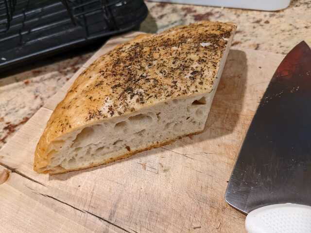

# 🫓 Focaccia

_roughly based on Ken Forkish's recipe_

## Ingredients

- 500g flour
- 350g warm water
- 10g salt
- 1 tablespoon instant yeast (or scoop of starter)
- 1/4 cup olive oil
- herbs de provence for topping (or dried rosemary, thyme, marjoram, oregano,
  basil, whatever you have in your cupboard!)
- optional, sweat some fresh sliced garlic in olive oil for topping after baking

## Directions

1. Mix flour + salt + yeast in a medium bowl, add water and thoroughly mix with
   hands or mixer. Cover and rest for about 20 minutes.
2. Do initial folds (wet hands, pull corner of dough over the top, repeat around
   the edge 4-6 times), cover and into the fridge overnight.
3. About an hour or two before baking, take out of the fridge, do a second round
   of folds. Cover and proof while the oven preheats to ~400F.
4. Pour about 1/4 cup olive oil in a cast iron skillet or dutch oven. Scoop the
   dough out of the bowl into the skillet or dutch oven on top of the olive oil
   and press out with your fingers until about 1" high.
5. Poke the top all over with your fingers to create some divets, top with the
   dried herbs and bake for about 30 minutes, until the top is golden brown.
6. When it comes out of the oven immediately pour over the garlic oil (or just
   olive oil if lazy :smile:), and sprinkle with salt, flaky salt if you have
   it.
