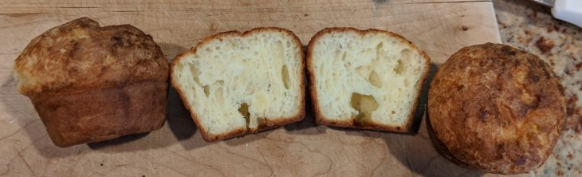

# 🧁 Popover muffins

*These are more muffin-like in shape and size, still with a good popover
interior but not the classic gigantic puffballs*

[Original
recipe](https://www.seriouseats.com/recipes/2012/03/popover-recipe.html)

## Ingredients

- 3 tablespoons melted butter, plus more for greasing pan
- 1 1/2 cups whole milk
- 4 eggs
- 3/4 teaspoon salt
- 1 1/2 cups all purpose flour
- 2-3 tablespoons white granulated sugar (optional)
- 1 teaspoon vanilla extract (optional)

## Directions

*Note: if you have a large pourable container like a large pyrex, mix everything
in there and you can pour directly into the muffin cups*

1. Preheat oven to 450°F. Grease popover pan well with butter.
2. In a large bowl, whisk together milk, eggs, and salt (and optional sugar +
   vanilla extract). Whisk in butter. Add flour and whisk until smooth.
3. Fill each cup 2/3 full with batter. Bake popovers until golden, 30 minutes.
   Let cool for 5 minutes in pan then turn out onto wire rack. Serve
   immediately.
