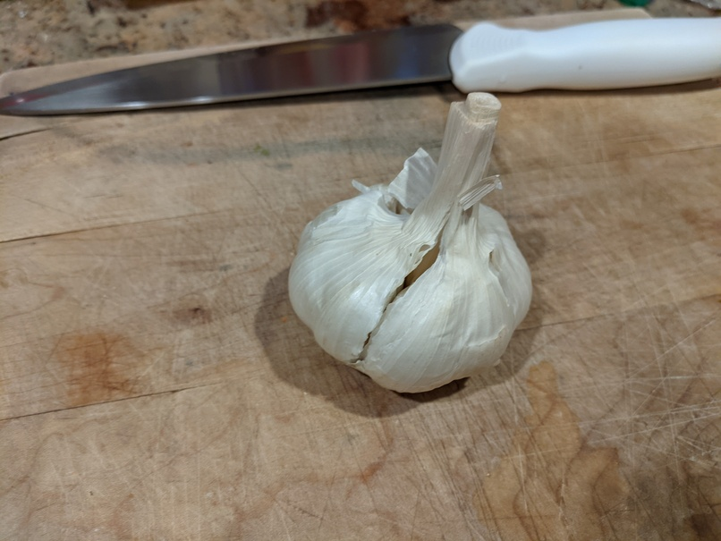
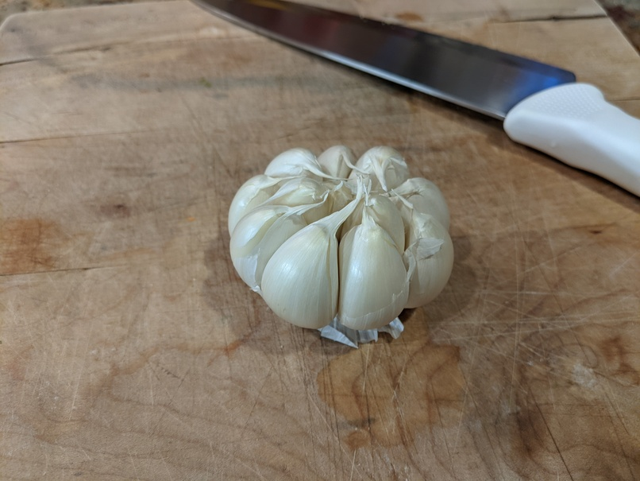
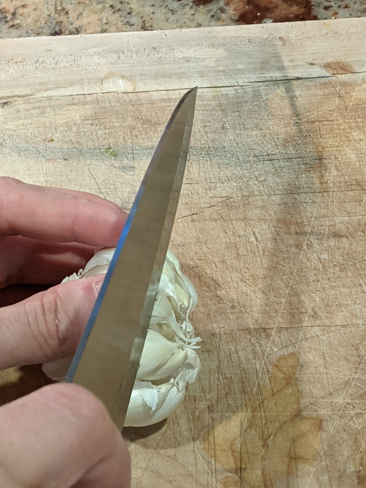
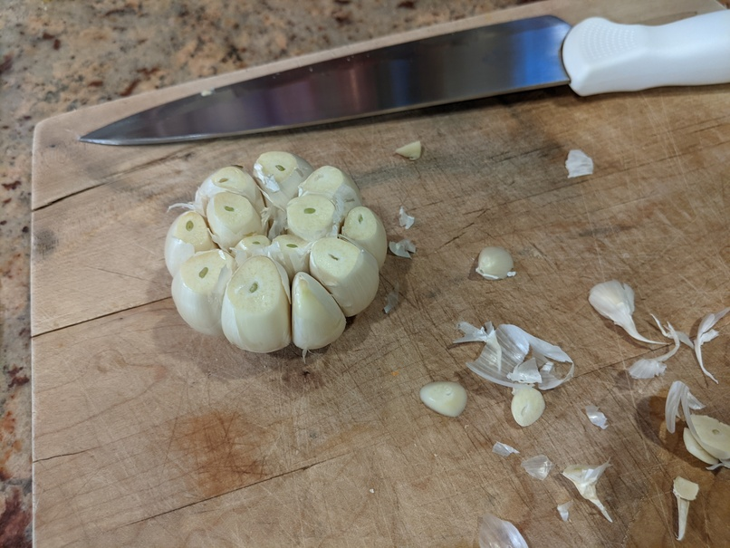
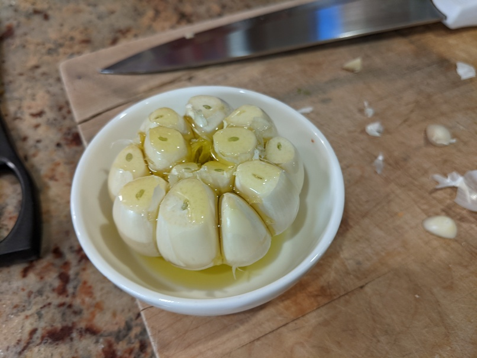
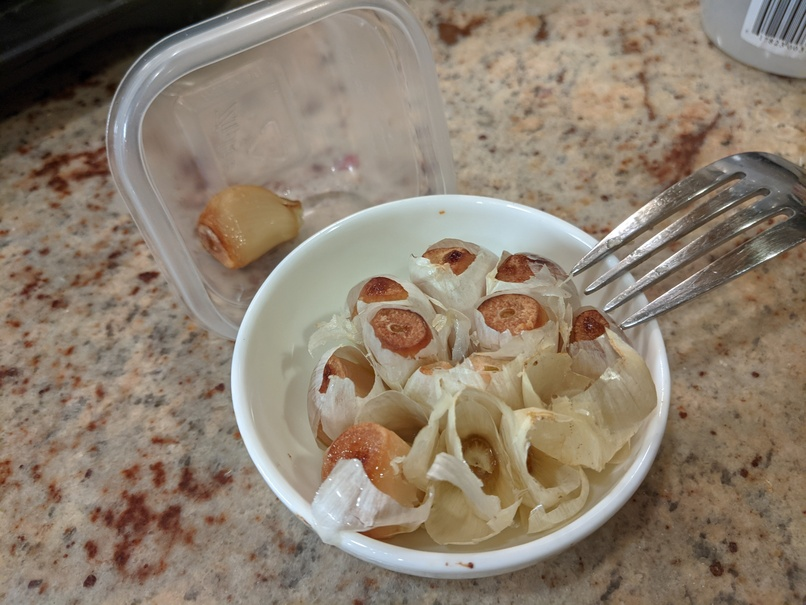

# 🧄 Roasted Garlic

See also[Serious Eats](https://www.seriouseats.com/roasted-garlic) on the
subject.

## Ingredients

- 1 head of garlic
- 2-3 teablespoons olive oil

## Directions

1. preheat oven to 400-425F
2. peel all but the innermost paper off a whole head of garlic

   
   

3. use a knife to trim the top 1/4" (5mm) or so off the top of each clove (chop
   your knife through the top of the head instead of doing each clove
   individally)

   
   

4. place in a small oven-safe ramikin or pyrex (or wrap in aluminum foil) and
   drizzle a tablespoon or two of olive oil over the top

   

5. roast in the oven until the top of the garlic cloves start to brown (15-20
   minutes or so). to remove the cloves, let the head cool and then squeeze out
   with your fingers, or use a fork to pull them out of the skin

   
