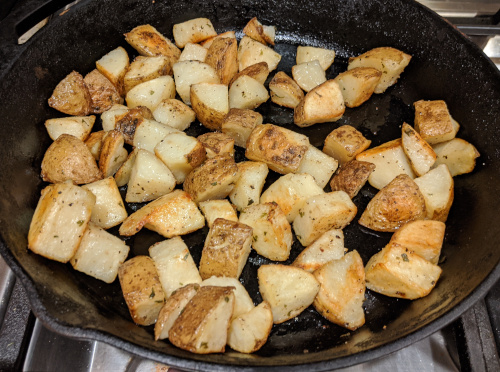

# 🥔 Crispy potatoes

[Original
recipe](https://www.seriouseats.com/recipes/2016/12/the-best-roast-potatoes-ever-recipe.html)

## Ingredients

- salt and pepper
- russet or yukon gold potatoes, 1" pieces
- olive oil / duck fat / goose fat / chicken fat / bacon grease
- (optional) parsley, rosemary, sage, etc, minced garlic. also good is cumin,
  paprika
- (optional) 1/2 teaspoon baking soda

## Directions

1. Preheat oven to 425 F, put cast iron skillet in to preheat
2. cover diced potatoes with 1/2" of water in a big pot, add 2 tablespoons salt
   and optionally baking soda, boil until tender
3. (optional) if using garlic, toast it in a pan a little bit with the herbs and
   fat. scoop out the garlic/herbs and reserve, the oil will be used for
   roasting
4. drain potatoes, rest 30 seconds to evaporate a little more moisture. shake
   thaem bit in the pot or bowl to make a little mashed-potato like coating on
   them. toss with the fat, season with salt and pepper (and other spices if
   using)
5. remove cast iron skillet from the oven, add some fat to the pan to coat, and
   add the potatoes
6. roast for about 20 minutes. bottom side of the potatoes should be crispy,
   turn them over to toast the other side for another 25-35 minutes
7. toss with the reserved herb/garlic mixture, add more salt + pepper if
   necessary

